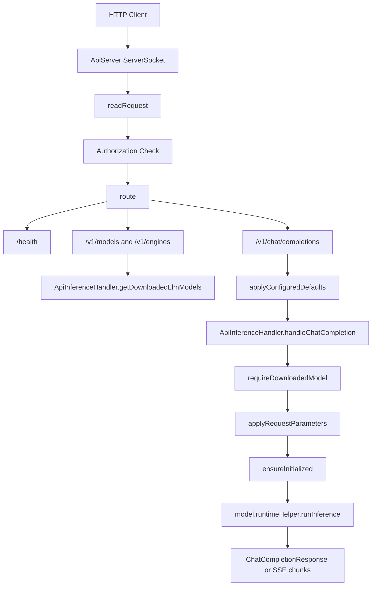

# 系统架构

## 项目定位

本仓库基于 Google AI Edge Gallery Android 项目修改，目标是在移动端 App 内提供本地 OpenAI 兼容 API 服务，使本机或局域网客户端可以通过 HTTP 调用已下载的本地 LLM 模型。

核心变化集中在 Android App 内部：新增本地 API 服务、API 配置页面、日志诊断能力、OpenAI 兼容数据模型，以及通过现有 LiteRT-LM 推理链路执行聊天补全。

## 顶层结构

```text
gallery/
├── Android/src/                         # Android 工程根目录
│   ├── app/build.gradle.kts             # App 构建配置
│   └── app/src/main/
│       ├── AndroidManifest.xml          # 权限、cleartext traffic、Activity/Service 声明
│       └── java/com/google/ai/edge/gallery/
│           ├── server/                  # 本地 API 服务和推理桥接
│           ├── data/                    # 配置、模型、日志和 API 数据模型
│           ├── ui/settings/             # API Server 设置页面
│           ├── ui/logs/                 # HTTP 日志页面
│           └── customtasks/agentchat/    # 上游 AgentChat、Skill、MCP 相关代码
├── README.md                            # 项目说明和 API 手册
├── BUILD_MANUAL.md                      # 构建手册
├── ROADMAP.md                           # 未来功能规划
└── .monkeycode/docs/                    # 本文档集
```

## 核心组件

| 组件 | 主要职责 |
|------|----------|
| `ApiServer` | 打开 `ServerSocket`，处理 HTTP 请求，路由到具体 API，执行认证和响应写回 |
| `ApiInferenceHandler` | 将聊天请求映射到已下载模型，应用推理参数，调用 `runtimeHelper` 执行推理 |
| `ApiServerManager` | 在应用进程级持有 API Server，避免页面销毁导致服务停止 |
| `ApiServerViewModel` | 将 UI 操作转发给 `ApiServerManager`，暴露状态流 |
| `ApiServerConfigManager` | 从 `SharedPreferences` 读写 API 服务配置 |
| `ApiServerSettingsScreen` | 配置 Host、Port、认证、默认模型、采样参数和加速器 |
| `HttpTrafficLogger` | 记录 REQUEST、RESPONSE、ERROR、DEBUG、CRASH 日志并持久化最近日志 |

## 本地 API 请求链路



## 服务生命周期

`GalleryApplication.onCreate()` 调用 `ApiServerManager.initialize(this)`。`ApiServerManager` 使用 `CoroutineScope(SupervisorJob() + Dispatchers.IO)` 和 `Mutex` 管理服务启动与停止。`ApiServerSettingsScreen` 中的开关通过 `ApiServerViewModel.startServer()` 或 `stopServer()` 转发到 `ApiServerManager`。

`ApiServerManager` 是 `object` 单例，持有 `apiServer` 实例和 `serverStatus`、`serverInfo` 状态流。其源码注释说明了设计原因：Compose 页面和 ViewModel 属于 UI 生命周期，API 服务由应用进程级 manager 持有，以便用户离开 API 设置页面后服务继续运行。

## HTTP 服务实现

`ApiServer` 使用 Java `ServerSocket`。启动时根据 `ApiServerConfig.host` 解析 `InetAddress`，绑定 `config.port`，设置 `reuseAddress = true`，启动 daemon accept 线程 `local-api-server`，并通过 cached thread pool 处理客户端连接。

请求读取由 `readRequest()` 手工解析：读取 HTTP header 到 CRLF 分隔符，解析 method 和 path，将 header key 转为小写，并根据 `content-length` 读取 body。

响应统一写入 `Content-Type`、`Content-Length`、`Connection` 和 CORS header。普通响应使用 `Connection: close`，SSE 场景使用 `Connection: keep-alive`。

## 推理链路

`ApiInferenceHandler` 依赖 `ModelManagerViewModel` 获取模型和任务状态。非流式请求流程为：生成请求 ID、超时控制、并发许可、模型校验、任务查找、参数应用、模型初始化、重置对话、执行推理、清理输出、返回 `ChatCompletionResponse`。

流式请求使用同一初始化和推理链路，但 `resultListener` 将增量 `partialResult` 通过回调写入 SSE chunk。服务端在流结束时写入 `data: [DONE]`。

## 配置架构

API 配置由 `ApiServerConfig` 表示，由 `ApiServerConfigManager` 保存在 `SharedPreferences("api_server_config")` 中。`requestTimeout` 读取时使用 `coerceAtLeast(180000L)`，确保最小 180 秒。

## 日志架构

本地 API 相关日志统一包含 `LOCAL_API` 标记。`HttpTrafficLogger` 将日志写入内存队列和 `SharedPreferences`。内存最多保留 1000 条，持久化最近 100 条。日志类型包含 `REQUEST`、`RESPONSE`、`ERROR`、`DEBUG`、`CRASH`。

## MCP 与 Skill 代码位置

仓库包含上游 AgentChat 相关 MCP 和 Skill 代码，位于 `customtasks/agentchat/`。当前本地 API Server 的 `ChatCompletionRequest` 没有 `tools` 或 `tool_choice` 字段，`ApiInferenceHandler` 中也没有 OpenAI 工具调用解析逻辑。MCP 工具调用对 API Server 的扩展记录在 `ROADMAP.md` 中。
