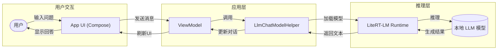
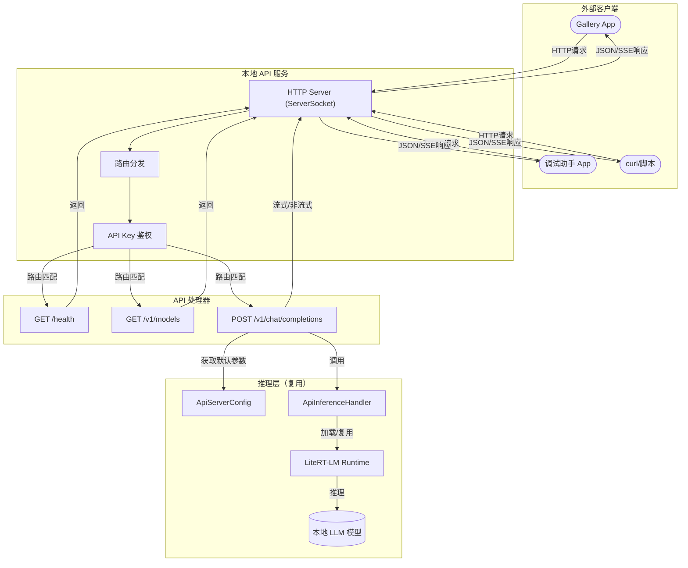

# API 服务架构对比

本文档对比原始版本和魔改版在调用本地 LLM 模型时的过程链路差异。

## 原始版本（无 API 服务）

原始 Google AI Edge Gallery 只能在 App 内部直接使用本地 LLM 模型：



**特点：**
- 只能在 App 内部使用
- 用户必须打开 Gallery App
- 没有网络接口
- 无法被其他应用调用

---

## 魔改版（带 API 服务）

魔改版增加了本地 HTTP API 服务，支持本机或局域网内其他客户端调用：



**特点：**
- 支持多客户端同时访问
- 提供 OpenAI 兼容接口
- 支持本机访问（127.0.0.1）
- 支持局域网访问（0.0.0.0）
- 可选 API Key 认证
- 支持 SSE 流式响应
- 支持配置默认模型和采样参数

---

## 关键差异对比

| 维度 | 原始版本 | 魔改版 |
|------|---------|--------|
| **访问方式** | 仅 App 内部 | HTTP API + App 内部 |
| **协议** | 直接函数调用 | HTTP + SSE |
| **客户端数量** | 单用户 | 多客户端 |
| **网络访问** | 不支持 | 本机 + 局域网 |
| **接口标准** | 私有 | OpenAI 兼容 |
| **认证** | 无 | 可选 API Key |
| **流式输出** | UI 内部流式 | SSE 流式 |
| **默认参数** | 每次配置 | API Server 页面设置 |
| **并发请求** | 单会话 | 支持并发 |
| **日志标记** | 分散 | `LOCAL_API` 统一标记 |

---

## 魔改版数据流向示例

### 流式聊天补全（SSE）

```
客户端请求                     服务端处理                    LLM推理
    |                              |                           |
    | POST /v1/chat/completions   |                           |
    |------------------------------>|                           |
    | 包含: model, messages,      |                           |
    |       stream=true            |                           |
    |                              | 解析请求参数              |
    |                              | 应用默认值                |
    |                              | 调用 ApiInferenceHandler  |
    |                              |-------------------------->|
    |                              |                          |
    |                              | 返回推理结果(chunk)       |
    |  data: {"choices":[{"delta": |<--------------------------|
    |    {"content":"你好"}}]}     |                          |
    |<------------------------------|                          |
    |                              | 继续推理...              |
    |                              |                          |
    |  data: {"choices":[{"delta": |                          |
    |    {"content":"！"}}]}       |                          |
    |<------------------------------|                          |
    |                              |                          |
    |  data: [DONE]                | 推理结束                 |
    |<------------------------------|<--------------------------|
```

### 非流式聊天补全

```
客户端请求                     服务端处理                    LLM推理
    |                              |                           |
    | POST /v1/chat/completions   |                           |
    |------------------------------>|                           |
    | stream=false                 | 等待完整响应             |
    |                              |-------------------------->|
    |                              |                          |
    |                              | 返回完整结果             |
    | 完整 JSON 响应               |<--------------------------|
    |<------------------------------|                          |
    |                              |                          |
```

---

## 组件说明

### ApiServer（HTTP 服务层）
- **Native ServerSocket**: 不使用 Ktor，纯 Java Socket 实现
- **路由分发**: `/health`, `/v1/models`, `/v1/engines`, `/v1/chat/completions`
- **CORS 支持**: 跨域请求处理
- **SSE 实现**: 流式响应分块发送

### ApiInferenceHandler（推理处理层）
- **模型管理**: 复用现有 LiteRT-LM 运行时
- **参数应用**: 合并请求参数与默认值
- **并发控制**: Semaphore 控制同时推理数
- **超时处理**: 协程超时机制

### ApiServerConfig（配置层）
- **默认模型**: 未传 model 时使用
- **采样参数**: temperature, max_tokens, top_p, top_k
- **推理后端**: CPU/GPU/NPU/TPU 选择
- **认证配置**: API Key 开关

### 与原始版本的复用关系

```
原始 Gallery App:
  └── LlmChatModelHelper.kt (UI 层直接调用)
         └── LiteRT-LM Runtime (模型推理)

魔改版 API Server:
  └── ApiInferenceHandler.kt (HTTP 层调用)
         └── LiteRT-LM Runtime (复用同一套推理) <--┐
                                                 |
  └── LlmChatModelHelper.kt (UI 层仍可调用) ------┘
```

**关键**: 魔改版复用了原始的 `LiteRT-LM Runtime`，没有重新实现推理逻辑，只是增加了一个 HTTP 入口。
